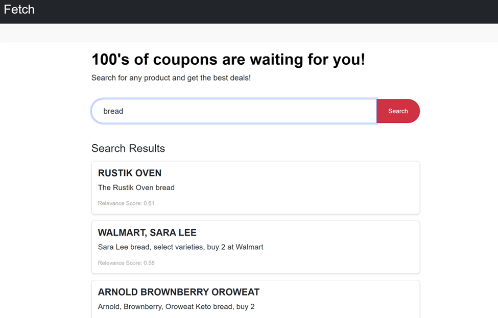

# Fetch App

### By Sai Shreyas Bhavanasi

To interact with the app, visit demo at: [https://fetchdemo.bsai.app/](https://fetchdemo.bsai.app/)

Dependencies: 

- Python 3.9

- Pinecone (I used a free tier of pinecone. You will need an API key from pinecone)

  - Pinecone is a vector database used to perform semantic search


### Running locally:

`git clone https://github.com/b-sai/fetch_takehome.git`

`python -m venv venv`

`source venv/bin/activate`

`pip install -r requirements.txt`

Obtain a pinecone API key and create a `.env` file in the root with the follwing keys:

```
PINECONE_API=
MODEL_NAME=
PINECONE_ENV=us...
IDX_NAME="indexname"
```

Prepare data to be inserted into Pinecone by running: `python prepare_data.py` (This will take a minute or two)

Run Flask using `python app.py`

NOTES: 

1. for model names see: [https://www.sbert.net/docs/pretrained_models.html](https://www.sbert.net/docs/pretrained_models.html). I use `multi-qa-MiniLM-L6-cos-v1`


---
For more details and reasoning behind data preparation, please see `data_preparation.ipynb`

### About the project

- Search
  - I used semantic similarity approach to retrieve values most similar to what the user searches for
  - I get 20 most similar items and then filter on a threshold above .3 which I found through experimentation
  - I used pinecone vector database to store and retrieve the embeddings. This was don’t to make it similar to a production setting
- Embedding
  - Used an embedding model (multi-qa-MiniLM-L6-cos-v1) from sentence-transformer
  - Chose a lightweight model so that it uses less RAM and to ensure it had a smaller embedding size to reduce storage size
  - Model is trained for semantic search on 215M question, answer pairs
- Website
  - Used Flask for frontend and backend for creating API routes. Flask was lightweight enough to approach this problem
- Deployment
  - Deployed app using railway.app

## Demo


